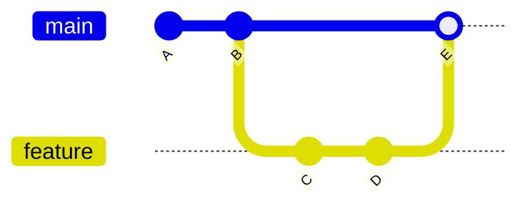

```
# Directed Acyclic Graph (DAG)

Git history is not a linear list; it is a **Directed Acyclic Graph (DAG)**. This means commits point to their parents, and time flows in one direction (acyclic).

## 1. ASCII Graph Visualization



*Representation in ASCII:*
```text
      C --- D   <-- feature
     /       \
A --- B ------- E   <-- main
```

## 2. Explanation of Merge Commits
A **Merge Commit** (like `E` above) is special because it has **two parents** (`B` and `D`).
- It brings two divergent histories back together.
- It represents the instant where the `feature` branch was combined into `main`.

## 3. Why Rebasing Rewrites History
**Rebasing** explicitly *changes* the parents of commits.
- If we rebased `feature` onto `main` (instead of merging), we physically pick up `C` and `D` and re-apply them on top of the latest `main`.
- Because the **parent** is part of the commit header (and thus the hash calculation), changing the parent **changes the commit Hash**.
- `C` becomes `C'`, and `D` becomes `D'`. The old commits are abandoned. Use with caution on shared branches!
```